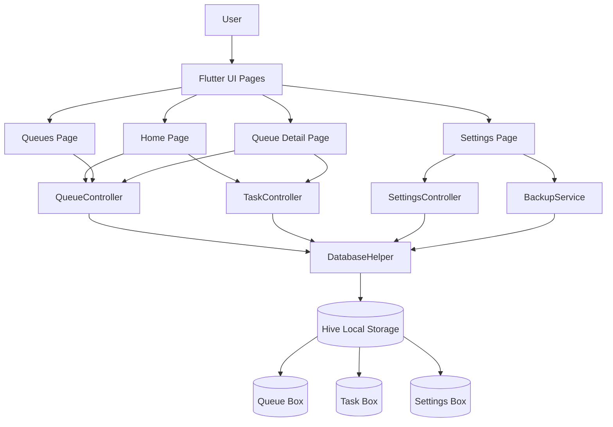
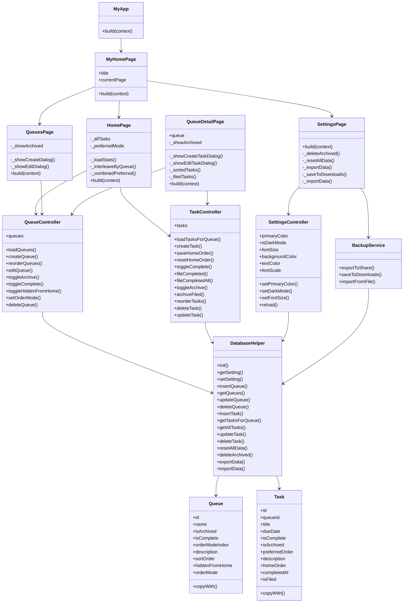
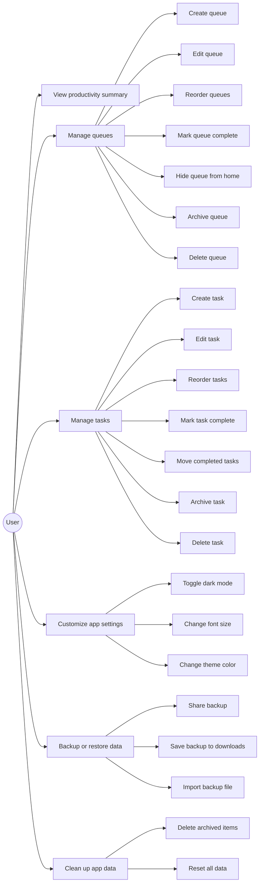
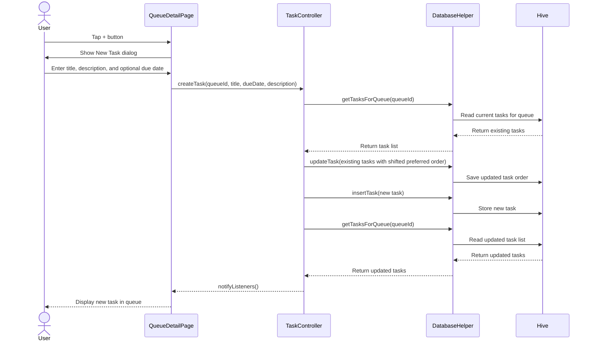
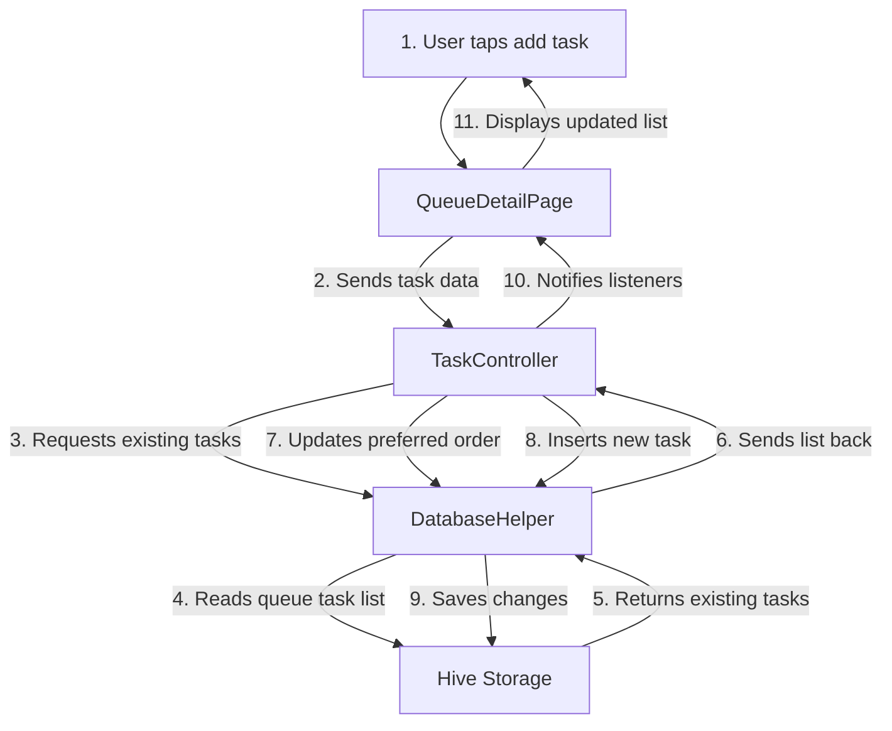

# Productivity Planner

**Jason Kamphuis & Gabrielle Godin**

**Jira**: [https://mail-team-pe717onf.atlassian.net/jira/software/projects/KAN/boards/2](https://mail-team-pe717onf.atlassian.net/jira/software/projects/KAN/boards/2)

## 1) Abstract

Productivity Planner is a Flutter mobile application designed to help users organize tasks into separate queues. The app allows users to create queues, add tasks, set optional due dates, mark work as complete, and archive or delete old items. It also includes a combined home view that summarizes the user's current workload, showing tasks to complete, tasks due today, past-due tasks, and completed tasks.

The main goal of Productivity Planner is to give users a simple task-management system that separates work into organized queues while still allowing all active tasks to be viewed together. The application stores data locally using Hive, so users can continue managing their tasks without needing a server or internet connection. Backup and import tools are also included so users can export their planner data and restore it later.

---

## 2) Introduction

Many productivity apps either show tasks in one long list or require users to create complex project structures. Productivity Planner takes a simpler approach by organizing work into queues. A queue can represent a class, project, chore list, assignment group, or any other category of work. Each queue contains its own tasks, but the home page also combines tasks from all active queues so the user can decide what to work on next.

The app is built with Flutter and Dart. It uses the Provider package for state management and Hive for local storage. Since the project stores queues, tasks, and settings on the device, it does not rely on an external database or user login system. This makes the application lightweight and easier to run during development.

Major features include:

* Creating, editing, reordering, completing, archiving, and deleting queues
* Creating, editing, reordering, completing, archiving, and deleting tasks
* Optional due dates and task descriptions
* A home dashboard with task statistics
* A combined queue view with Due Next and Preferred sorting modes
* Queue-specific sorting by due date or preferred order
* Completed sections for filed tasks and completed queues
* Dark mode, font-size settings, and theme color selection
* JSON backup, import, and save-to-downloads options
* Reset and cleanup options for archived data

---

## 3) Architectural Design

Productivity Planner follows a local client-side architecture. The Flutter user interface communicates with controllers, and the controllers communicate with the local Hive database helper. There is no separate server, external API, or cloud database required for the core app functionality.

The general structure is:

```text
User Interface Pages
        ↓
Provider Controllers
        ↓
DatabaseHelper
        ↓
Hive Local Storage
        ↓
Queue, Task, and Settings Data
```

The app is split into five main source folders:

```text
lib/
├── controllers/
│   ├── queue_controller.dart
│   ├── settings_controller.dart
│   └── task_controller.dart
├── database/
│   ├── backup_service.dart
│   └── database_helper.dart
├── models/
│   ├── queue_model.dart
│   ├── queue_model.g.dart
│   ├── task_model.dart
│   └── task_model.g.dart
├── pages/
│   ├── home_page.dart
│   ├── queue_detail_page.dart
│   ├── queues_page.dart
│   └── settings_page.dart
├── utils/
│   └── date_format.dart
└── main.dart
```

### 3.1) Architecture Diagram



Productivity Planner uses a local-storage design because the app is centered around personal task management. This avoids requiring login, server uptime, or internet access. The user’s queues, tasks, and settings are stored directly on the device using Hive.

---

### 3.2) Class Diagram



The app is organized around a simple controller-based structure. The page files are responsible for user interface and user interaction. The controller files handle the app logic and notify the UI when data changes. The database helper handles all local persistence through Hive.

---

### 3.3) Use-Case Diagram



The main actor is the user. The user interacts with the application by managing queues and tasks, changing settings, and backing up or restoring local planner data.

---

### 3.4) Sequence Diagram

The following sequence shows the process of creating a task inside a queue.



This sequence shows how the UI calls the controller, the controller updates the local database, and Provider refreshes the interface after the data changes.

---

### 3.5) Communication Diagram



The communication diagram shows the same task-creation process as the sequence diagram, but emphasizes the objects involved and the direction of data flow.

---

## 4) User Guide / Implementation

### 4.1) Starting the Application

When the app launches, the user is taken to the main Productivity Planner interface. The application has a bottom navigation bar with three main sections:

```text
Home | Queues | Settings
```

The Home page gives the user a combined view of their active tasks. The Queues page allows the user to create and manage task queues. The Settings page allows the user to customize the app and manage backups.

---

### 4.2) Home Page

The Home page provides a productivity summary and a combined list of active tasks across queues. At the top of the page, the user can see four summary cards:

* Tasks To Complete
* Due Today
* Past Due
* Completed

Below the summary, the app displays a Combined Queue. The combined queue can be shown in two modes:

```text
Due Next
Preferred
```

Due Next mode sorts tasks with due dates first, placing the soonest tasks at the top. Tasks without due dates are placed after dated tasks. Preferred mode either interleaves tasks from active queues or uses a custom home order if the user has manually reordered tasks.

The user can mark tasks complete directly from the Home page. Completed tasks remain visible until the user selects Move Completed Tasks, which moves them into the Completed section.

---

### 4.3) Queues Page

The Queues page is where the user manages their queues. A queue is a category or list that contains tasks. For example, a user could create queues for school, work, personal errands, or specific projects.

From the Queues page, the user can:

* Create a new queue
* Add an optional queue description
* Open a queue to view its tasks
* Edit a queue name or description
* Reorder active queues
* Mark a queue complete
* Hide or show a queue on the Home page
* Archive or unarchive a queue
* Delete a queue and its tasks
* Show or hide archived queues

Completed queues are separated from active queues. The app also includes an Archive All option for completed queues that have not yet been archived.

---

### 4.4) Queue Detail Page

The Queue Detail page displays the tasks inside a selected queue. This is where the user can create and manage individual tasks.

When creating a task, the user can enter:

* Task title
* Optional description
* Optional due date

Each queue supports two task ordering modes:

```text
Due Next
Preferred
```

In Due Next mode, tasks are sorted by due date. Tasks with due dates appear before tasks without due dates. In Preferred mode, the user can manually reorder tasks inside the queue.

From the Queue Detail page, the user can:

* Create tasks
* Edit task title, description, or due date
* Clear a task due date
* Mark tasks complete or incomplete
* Move completed tasks to the Completed section
* Archive or unarchive tasks
* Delete tasks
* Show or hide archived tasks
* Archive all filed completed tasks

Completed tasks can be moved out of the active list using the Move Completed Tasks button. Once moved, they appear in the Completed section. This keeps the active task list clean while still allowing the user to view completed work.

---

### 4.5) Settings Page

The Settings page allows the user to customize the application and manage stored data.

The app supports the following appearance settings:

* Dark mode
* Font size selection
* Primary theme color selection

Available font-size options are:

```text
Very small
Small
Medium
Large
```

The theme color picker allows the user to choose from several preset colors. These settings are stored locally and applied throughout the application.

---

### 4.6) Backup and Sync

The Backup & Sync section allows the user to export and import local planner data. This is useful because the app stores data on the device rather than on a cloud server.

The backup options are:

* Share: creates a JSON backup file and opens the system share sheet
* Save to Downloads: saves a JSON backup file directly to the Downloads folder
* Import: allows the user to select a previous JSON backup file and restore it

Importing a backup replaces the current queues and tasks with the contents of the selected file. The app asks the user to confirm before importing because the action cannot be undone.

---

### 4.7) Danger Zone

The Danger Zone contains destructive actions. These are separated from the normal settings because they permanently remove data.

The danger-zone options are:

* Delete archived items
* Reset all data

Delete archived items permanently removes archived tasks and archived queues. Reset all data deletes all queues, tasks, and settings. The reset process uses extra confirmation to reduce the chance of accidental deletion.

---

## 5) Technical Implementation

### 5.1) Technology Stack

Productivity Planner uses the following technologies:

```text
Flutter
Dart
Provider
Hive
Hive Flutter
Path Provider
Share Plus
File Picker
Build Runner
Hive Generator
```

Flutter provides the cross-platform user interface. Provider handles state updates between the controllers and UI. Hive stores local queue, task, and settings data. File Picker, Path Provider, and Share Plus support the backup and import features.

---

### 5.2) Local Data Storage

The application stores data in three Hive boxes:

```text
queues
tasks
settings
```

The Queue and Task models are Hive objects. Each model has a generated adapter file that allows Hive to read and write the object fields.

Queue data includes:

* Queue ID
* Name
* Archived status
* Completed status
* Ordering mode
* Description
* Sort order
* Hidden-from-home status

Task data includes:

* Task ID
* Queue ID
* Title
* Due date
* Completed status
* Archived status
* Preferred order
* Description
* Home order
* Completion timestamp
* Filed status

The settings box stores simple key-value settings such as dark mode, font size, theme color, and home preferred mode.

---

### 5.3) State Management

The app uses three main Provider controllers:

```text
QueueController
TaskController
SettingsController
```

QueueController manages queue-related actions such as creating, editing, reordering, archiving, completing, hiding, and deleting queues.

TaskController manages task-related actions such as creating, editing, completing, filing, archiving, reordering, and deleting tasks.

SettingsController manages appearance-related settings such as dark mode, font scale, and primary theme color.

Each controller extends ChangeNotifier. After a controller changes data, it calls notifyListeners so the UI can rebuild with updated information.

---

### 5.4) Date Formatting

The app stores task due dates as strings in the format:

```text
YYYY-MM-DD
```

The date formatting utility converts these stored date strings into user-friendly labels such as:

```text
Due today (Jan 5, 2026)
Due tomorrow (Jan 6, 2026)
Due in 4 days (Jan 9, 2026)
Overdue by 2 days (Jan 3, 2026)
```

This allows the app to display due dates consistently across the Home page and Queue Detail page.

---

## 6) Installation, Running, and Testing

### 6.1) Prerequisites

Before running the app, make sure Flutter is installed and working.

Run:

```bash
flutter --version
flutter doctor
```

The project uses the following Dart SDK constraint:

```yaml
environment:
  sdk: ^3.12.1
```

If running the app as a Linux desktop application, Linux desktop support must also be enabled:

```bash
flutter config --enable-linux-desktop
```

If Linux desktop dependencies are missing, install them with:

```bash
sudo apt-get update
sudo apt-get install -y clang cmake ninja-build pkg-config libgtk-3-dev liblzma-dev
```

---

### 6.2) Navigate to the Flutter Project

From the repository root, move into the Flutter project folder:

```bash
cd productivity_planner_app/productivity_planner
```

---

### 6.3) Install Dependencies

Install the Flutter dependencies with:

```bash
flutter pub get
```

---

### 6.4) Generate Hive Adapter Files

The repository already includes the generated Hive adapter files:

```text
queue_model.g.dart
task_model.g.dart
```

If the model files are changed, regenerate the adapters with:

```bash
dart run build_runner build
```

If there are conflicts with older generated files, use:

```bash
dart run build_runner build --delete-conflicting-outputs
```

---

### 6.5) Run the App

To see available devices, run:

```bash
flutter devices
```

To run the app as a Linux desktop application:

```bash
flutter run -d linux
```

To run the app on another connected device or emulator:

```bash
flutter run
```

To run as a web app from WSL:

```bash
flutter run -d web-server --web-hostname 0.0.0.0 --web-port 8080
```

Then open:

```text
http://localhost:8080
```

---

### 6.6) Run Unit Tests

Unit tests are stored in the `unit_test/` folder. These tests cover models, utilities, controllers, database logic, backup behavior, and lightweight page-level behavior.

Run all unit tests with:

```bash
flutter test unit_test/models unit_test/utils unit_test/controllers unit_test/database unit_test/pages --concurrency=1
```

---

### 6.7) Run Integration Tests

Integration tests are stored in the `integration_test/` folder. These tests launch the app and verify that major app navigation works correctly.

Because the integration test runs the Linux desktop version of the app, it should be run with `xvfb-run` in WSL or other headless Linux environments.

If `xvfb-run` is not installed, install it with:

```bash
sudo apt-get update
sudo apt-get install -y xvfb
```

Run the integration test with:

```bash
xvfb-run -a --server-args="-screen 0 1280x720x24" flutter test integration_test/app_navigation_test.dart -d linux
```

---

### 6.8) Run All Tests Locally

To run both unit and integration tests locally:

```bash
flutter test unit_test/models unit_test/utils unit_test/controllers unit_test/database unit_test/pages --concurrency=1
xvfb-run -a --server-args="-screen 0 1280x720x24" flutter test integration_test/app_navigation_test.dart -d linux
```

---

### 6.9) Continuous Integration

This project uses GitHub Actions for continuous integration.

The workflow runs automatically on:

* pushes to `main`
* pull requests into `main`
* manual workflow dispatches

The CI workflow runs the unit tests first. If the unit tests pass, it then runs the Linux integration test using `xvfb-run`.

---

## 7) Risk Analysis and Retrospective

### 7.1) Risk Analysis

One major risk of the project is that all data is stored locally. This makes the app simple and usable without a server, but it also means the user is responsible for backing up their data. If the device is lost, damaged, or reset, the data may be lost unless the user exported a backup.

Another risk is that importing a backup replaces the current app data. This is useful for restoring a previous state, but it could cause accidental data loss if the wrong file is imported. The app reduces this risk by asking for confirmation before importing.

A third risk is related to deleting data. Since the app allows users to delete archived items and reset all data, accidental deletion could be serious. The app reduces this risk through confirmation dialogs, especially for the full reset option.

A final risk is that the app does not currently include user accounts or cloud sync. This keeps the app simpler and more private, but it also limits multi-device use. Users who want to move data between devices must use the backup and import features.

### 7.2) Retrospective

The strongest part of the project is the clear separation between pages, controllers, models, and database logic. This makes the code easier to understand and document. The controllers handle most of the app logic, while the pages focus on the user interface.

The local Hive database was a good choice for this project because the app does not need a full server or online database to function. The backup and restore feature also helps reduce the downside of local-only storage.

One area for future improvement would be cloud sync. This would allow users to access their tasks from multiple devices without manually exporting and importing files. Another improvement would be adding notifications for due dates, so users can receive reminders before tasks become overdue.

Testing was also expanded through unit tests and integration tests. The unit tests cover models, controllers, database behavior, backup behavior, settings behavior, and lightweight page-level behavior, while the integration test verifies that the main app launches and navigation works across the Home, Queues, and Settings pages.

---

## 8) Conclusion

Productivity Planner is a local Flutter task-management app that helps users organize work into queues while still providing a combined view of all active tasks. The application includes queue management, task management, due dates, completion tracking, archiving, custom ordering, appearance settings, and backup tools.

The project uses a clean Flutter structure with pages for the interface, controllers for state management, models for stored data, and a database helper for Hive persistence. This design keeps the app understandable and makes it easier to add future features.

Overall, Productivity Planner provides a practical and lightweight way for users to manage tasks without requiring an account, server, or internet connection.

---

## 9) Walkthrough

### 9.1) Create a Queue

1. Open the app.
2. Select the Queues tab.
3. Tap the + button.
4. Enter a queue name.
5. Optionally enter a description.
6. Tap Create.

The new queue appears in the queue list.

### 9.2) Add a Task

1. Open a queue from the Queues tab.
2. Tap the + button.
3. Enter a task title.
4. Optionally enter a description.
5. Optionally select a due date.
6. Tap Create.

The task appears in the selected queue.

### 9.3) Mark a Task Complete

1. Open the Home page or a Queue Detail page.
2. Tap the circle icon next to a task.
3. The task is marked complete and shown with a completed style.
4. Select Move Completed Tasks to move completed tasks into the Completed section.

### 9.4) Change Task Ordering

1. Open a queue.
2. Select Due Next to sort by due date.
3. Select Preferred to manually reorder tasks.
4. Drag tasks into the desired order.

The preferred order is saved locally.

### 9.5) Use the Home Page

1. Open the Home tab.
2. Review the summary cards.
3. Use Due Next to view tasks ordered by due date.
4. Use Preferred to view or customize the combined task order.
5. Complete tasks directly from the combined list.

### 9.6) Archive Completed Work

1. Complete one or more tasks.
2. Select Move Completed Tasks.
3. In the Completed section, archive individual tasks or use Archive all.
4. Archived tasks can be shown again using the Show archived option.

### 9.7) Change App Settings

1. Open the Settings tab.
2. Toggle Dark mode if desired.
3. Select a font size.
4. Choose a primary color.

The app updates the interface based on the selected settings.

### 9.8) Export a Backup

1. Open the Settings tab.
2. Go to Backup & Sync.
3. Select Share or Save to Downloads.
4. Save or send the generated JSON backup file.

### 9.9) Import a Backup

1. Open the Settings tab.
2. Select Import.
3. Confirm that current tasks and queues will be replaced.
4. Select a previously exported JSON backup file.
5. Wait for the import confirmation.

### 9.10) Reset the App

1. Open the Settings tab.
2. Go to Danger Zone.
3. Select Reset all data.
4. Confirm the reset.
5. Confirm the final warning.

The app clears all queues, tasks, and settings.